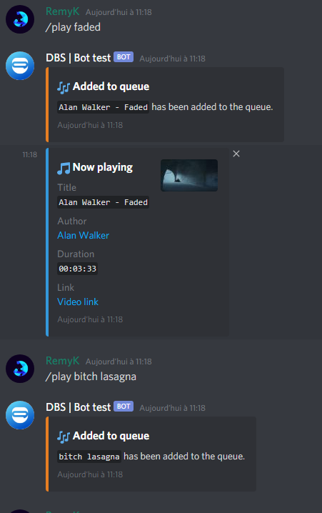

[](https://nodei.co/npm/discord-music-system/)

The discord-music-system is a very simple and powerful Discord.Js Music module.

**There are few commands**
- `play [search term || url]`
- `pause`
- `resume`
- `stop`
- `help`
- `skip`
- `np`
- `remove [song number in the queue]`
- `volume [0 - 100]`
- `queue`


__It's very simple to use__

**A little example :**

```javascript
const MusicBot = require("discord-music-system"); // Require the module

const bot = new MusicBot({ // Create the bot
    token: 'Some Discord Token', // You can find the token at https://discord.com/developers/applications/
    ytApiKey: 'A random YouTube API Key', // Video to explain how to get it: https://www.youtube.com/watch?v=VqML5F8hcRQ
    prefix: 'I think the prefix goes here', // Example: /
    game: 'Some funny game' // Example: /help
});

bot.run(); // Run the bot
```

**Image**



If you have any problems, you can contact : RemyK#3876
Discord Server : [Server Link](https://discord.gg/ZCzxymB)


**Made with ❤ by RemyK**
